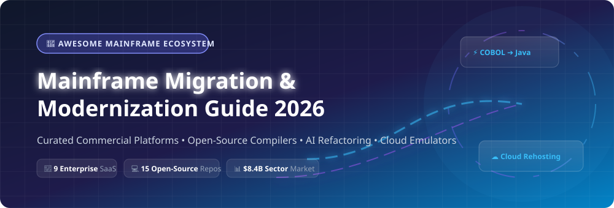

# 🚀 Awesome Mainframe Migration & Modernization

  

  
  
  
  
  
  

---

> 💡 **A curated ecosystem guide to commercial SaaS products, AI refactoring platforms, open-source compilers, and cloud rehosting frameworks for legacy IBM mainframe migration (COBOL, PL/I, Assembler, JCL, CICS, VSAM) to modern AWS, Azure, and Google Cloud infrastructures.**

---

## 📌 Table of Contents
- [🌐 Sector Market Overview](#-sector-market-overview)
- [🏢 Enterprise SaaS & Commercial Platforms](#-enterprise-saas--commercial-platforms)
- [💻 Open-Source GitHub Repositories & Tools](#-open-source-github-repositories--tools)
- [🛠 Modernization Strategies & Architectures](#-modernization-strategies--architectures)
- [🤝 How to Contribute](#-how-to-contribute)
- [📈 Star History](#-star-history)
- [💖 Support & Community](#-support--community)
- [📜 Disclaimer](#-disclaimer)

---

## 🌐 Sector Market Overview

> 📊 **Market Size & Structure**: The global Mainframe Modernization market is estimated at **~$8.4 Billion in 2025** and projected to expand to **~$15 Billion+ by 2030–2034** at a CAGR of ~9.5%. The market is **concentrated** among top cloud hyperscalers (Microsoft Azure, AWS, Google Cloud), legacy software consolidators (OpenText/Micro Focus, Amdocs/Astadia), and specialized automated refactoring providers (TSRI, CloudFrame, LzLabs).

---

## 🏢 Enterprise SaaS & Commercial Platforms

Below is a comparative breakdown of leading commercial platforms for mainframe migration, automated code transformation, and cloud rehosting. Table entries are sorted by **Company Size / Valuation (Descending)**.

| 🏢 Platform / Vendor | 🎯 Core Capabilities | 💰 Specific Starting Pricing | 🎁 Free Tier / Trial Limit | 📊 Company Size / Valuation |
| :--- | :--- | :--- | :--- | :--- |
| **[Microsoft Azure Mainframe Modernization](https://azure.microsoft.com/en-us/solutions/mainframe-modernization/)** | Rehost, refactor, and replatform IBM mainframe workloads to Azure. Integrates Raincode IMSql for IMS DB/DC to SQL Server migration. | Standard Pay-As-You-Go compute rates (e.g. D4s v5 ~$0.192/hr; Azure SQL Database from ~$0.015/vCore-hr). | **$200 Azure Credits** (valid 30 days) + 55+ services free for 12 months. | **~$3.1 Trillion** market cap ($245B+ annual revenue) |
| **[Google Cloud Dual Run](https://cloud.google.com/mainframe-dual-run)** | Dual-execution shadow testing platform running live workloads concurrently on mainframe and Google Cloud for zero-risk validation. | Pay-as-you-go compute/storage rates (e.g. Compute Engine e2-standard-2 from ~$0.067/hr) + enterprise dual-run license. | **$300 Free Credits** for new accounts (valid 90 days) + 20+ free tier products. | **~$2.1 Trillion** market cap ($330B+ annual revenue) |
| **[AWS Mainframe Modernization](https://aws.amazon.com/mainframe-modernization/)** | Automated refactoring (Blu Age) & replatforming managed runtime for COBOL, PL/I, and JCL on AWS infrastructure. | **~$0.31 per AWS CPU core/hour** for Blu Age Runtime + standard underlying EC2/EBS infrastructure usage. | **$200 AWS Sign-up Credits** + 750 free EC2 t2.micro/t3.micro hours/month for 12 months. | **~$2.0 Trillion** market cap ($570B+ annual revenue) |
| **[Astadia (Amdocs)](https://www.astadia.com/)** | Mainframe Migration Factory with automated CodeTurn, DataTurn, TestMatch, and DataMatch functional equivalence engines. | Project-based scoping starting at **~$15,000–$50,000+** per migration pilot phase or per 100k LOC module. | **Free Initial Code Assessment** / 14-day discovery workspace audit. | **~$10.5 Billion** market cap ($4.9B+ annual revenue) |
| **[Micro Focus (OpenText) Enterprise Suite](https://www.microfocus.com/)** | Enterprise-grade COBOL, PL/I development, test, and deployment platform for Linux, Docker, and hybrid cloud without rewrites. | Enterprise license starting at **~$2,500/core/year** or ~$0.45/vCore-hour on AWS/Azure Marketplace. | **30-Day Full-Featured Evaluation Trial** license for Enterprise Developer & Server. | **~$8.5 Billion** market cap ($5.8B+ annual revenue) |
| **[TSRI (JANUS Studio)](https://tsri.com/)** | AI-driven deterministic refactoring platform converting 35+ legacy languages (COBOL, Assembler, PL/I) to modern Java/C# with 99.9X% accuracy. | Fixed-price refactoring starting at **~$0.15–$0.40 per line of code (LOC)** with code warranty. | **Free Initial Codebase Assessment** (up to 50k LOC analyzed) + 30-day pilot scoping. | **~$50M–$100M** estimated revenue (Private IT Leader) |
| **[LzLabs (Software Defined Mainframe)](https://www.lzlabs.com/)** | Software Defined Mainframe (SDM) rehosting binary z/OS applications directly on modern Linux/cloud containers without rewriting. | Enterprise MIPS-reduction subscription starting at **~$10,000/month** or core-based annual software license. | **30-Day Sandbox / Proof-of-Concept** cloud environment (up to 5 MIPS allocation). | **~$30M–$50M** estimated revenue (Private Venture-Backed) |
| **[CloudFrame Continuum](https://cloudframe.com/)** | Execution-truth modernization engine capturing runtime behavior to optimize MIPS, rehost COBOL, or refactor to Java. | Subscription pricing starting at **~$5,000/month** per application module or per MIPS saved. | **14-Day Risk-Free Assessment Trial** (up to 10 COBOL programs converted to Java). | **~$15M–$30M** estimated revenue (Private Enterprise SaaS) |
| **[Advanced (Modern Systems)](https://modernsystems.oneadvanced.com/)** | End-to-end automated refactoring converting legacy COBOL, CICS, VSAM, and JCL into Java Spring Boot and cloud-native services. | Engagement milestones starting at **~$25,000** for assessment, discovery, and initial pilot transformation. | **Free Architectural Discovery Session** & 30-day proof-of-concept pilot. | **~$10M–$25M** estimated revenue (Private Managed Services Unit) |

---

## 💻 Open-Source GitHub Repositories & Tools

Curated open-source projects, COBOL compilers, mainframe emulators, parser libraries, and AI modernization agents. Repositories are sorted by **GitHub Star Count (Descending)**.

- **[COBOL Programming Course](https://github.com/openmainframeproject/cobol-programming-course)**  
    
  ⚡ Comprehensive training materials, labs, and modern syntax guides for learning and modernizing enterprise COBOL, hosted by the Open Mainframe Project.

- **[3270 Font](https://github.com/rbanffy/3270font)**  
    
  🖥️ Monospaced retro font designed for terminal emulators and modern IDEs emulating IBM 3270 mainframe display terminals.

- **[COBOL on Wheelchair](https://github.com/azac/cobol-on-wheelchair)**  
    
  🌐 Micro web-framework written for COBOL, enabling legacy COBOL programs to serve modern REST APIs and HTTP microservices.

- **[Node COBOL](https://github.com/IonicaBizau/node-cobol)**  
    
  🌁 Bridge for Node.js allowing execution and integration of legacy COBOL program logic directly within modern Node/JavaScript microservices.

- **[Hercules Mainframe Emulator](https://github.com/SDL-Hercules-390/hyperion)**  
    
  ⚙️ Open-source software implementation of System/370, ESA/390, and 64-bit z/Architecture mainframe hardware, capable of running legacy z/OS, z/VM, and z/VSE operating systems.

- **[AWS Mainframe Modernization CardDemo](https://github.com/aws-samples/aws-mainframe-modernization-carddemo)**  
    
  💳 Comprehensive sample COBOL/CICS/VSAM credit card management application for benchmarking mainframe refactoring and replatforming on AWS.

- **[OpenCobolIDE](https://github.com/OpenCobolIDE/OpenCobolIDE)**  
    
  📝 Simple, cross-platform graphical IDE for COBOL development powered by GnuCOBOL and PyQode.

- **[Otterkit COBOL](https://github.com/otterkit/otterkit-cobol)**  
    
  🔧 Modern, open-source Standard COBOL compiler and runtime targeting 64-bit systems and C# .NET ecosystem.

- **[Azure Legacy Modernization Agents](https://github.com/Azure-Samples/Legacy-Modernization-Agents)**  
    
  🤖 AI-powered agent framework using Microsoft Agent Framework to automate COBOL-to-Java Quarkus modernization and dependency extraction.

- **[Zowe Explorer VS Code Extension](https://github.com/zowe/zowe-explorer-vscode)**  
    
  🔌 VS Code extension providing direct access to z/OS datasets, PDS members, USS files, and jobs on IBM mainframes.

- **[Cobrix Parsing Engine](https://github.com/AbsaOSS/cobrix)**  
    
  📊 Pure Scala/Spark library for parsing complex mainframe COBOL copybooks and binary EBCDIC data files directly in Apache Spark pipelines.

- **[Zowe CLI](https://github.com/zowe/zowe-cli)**  
    
  ⌨️ Command-line interface powering modern DevOps workflows, CI/CD pipelines, and automated interactions with mainframe services.

- **[Cobol Check](https://github.com/openmainframeproject/cobol-check)**  
    
  🧪 Automated unit testing framework for COBOL applications, bringing TDD practice to legacy batch and interactive programs.

- **[z390 Portable Mainframe Assembler](https://github.com/z390development/z390)**  
    
  🧮 Java-based portable IBM System/390 assembler emulator and runtime, executing High Level Assembler (HLASM) and COBOL cross-platform.

- **[QWICS Architecture](https://github.com/pbrune1973/qwics)**  
    
  🏗️ Quick Web-Based Interactive COBOL Service rehosting transactional COBOL workloads in Java EE using GnuCOBOL, WildFly, and PostgreSQL.

---

## 🛠 Modernization Strategies & Architectures

1. **Rehosting (Lift & Shift)**: Move mainframe applications to cloud/x86 Virtual Machines without code changes using compilers or emulators (e.g., LzLabs SDM, Micro Focus Enterprise Server).
2. **Replatforming**: Migrate data and middleware (CICS to Tomcat, VSAM to PostgreSQL/DB2 on cloud) while keeping core business logic intact.
3. **Automated Refactoring**: Transform legacy COBOL/PL/I into modern Java Spring Boot or C# .NET microservices using deterministic AI engines (e.g., TSRI, Blu Age, Advanced).
4. **Dual Run Parallel Execution**: Run legacy mainframe and modern cloud applications concurrently with real-time data replication to verify functional equivalence (e.g., Google Cloud Dual Run).

---

## 🤝 How to Contribute

Contributions are warmly welcome! Please follow these simple guidelines:

1. 🍴 **Fork the Repository**
2. 🌿 **Create a Feature Branch** (`git checkout -b feature/awesome-tool`)
3. 📝 **Add/Update Entry** in `README.md` maintaining table/formatting consistency.
4. 📬 **Open a Pull Request** with a clear summary of changes.

---

## 📈 Star History

---

## 💖 Support & Community

Thank you for exploring **Awesome Mainframe Migration & Modernization**! If this repository helped you in your legacy transformation journey, enterprise architecture planning, or COBOL refactoring research, please consider supporting the project:

- 🌟 **Star this repository** to help others discover mainframe modernization tools.
- 🔀 **Fork & Contribute** by opening pull requests to add new tools, platforms, or case studies.
- 📢 **Share with your network** on LinkedIn, X, or developer forums.
- ☕ **Sponsor on GitHub**: Support ongoing open-source research on the [GitHub Sponsor Dashboard](https://github.com/sponsors/ishandutta2007).

---

## 📜 Disclaimer

- This is a **community-curated** open-source list for informational and educational purposes.
- Enterprise mainframe modernization involves mission-critical core systems. Always conduct thorough functional equivalence testing and risk assessments before migration.
